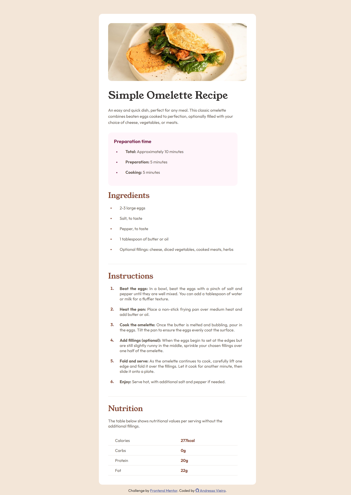
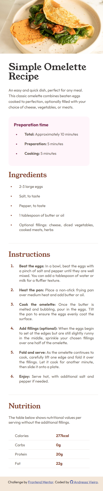

# Frontend Mentor - Recipe page solution 🍳

This is a solution to the [Recipe page challenge on Frontend Mentor](https://www.frontendmentor.io/challenges/recipe-page-KiTsR8QQKm).

## Table of contents

- [Overview](#overview)
  - [Screenshots](#screenshots)
  - [Links](#links)
  - [Built with](#built-with)
- [Acknowledges](#acknowledges)

## Overview

### Screenshots

💻 Large Screens

📱 Small Screens

### Links

- Live Site URL: [GitHub Pages](https://ansomething.github.io/recipe-page/)

### Built with

- Visual Studio Code
- Semantic HTML5 Markup
- CSS Custom Properties
- Mobile-First Workflow

### Acknowledges

I must say this was an interesting experience. I still have a lot to learn, this is a basic page and I still faced some struggles. But it was nice.

I'm not 100% satisfied, especially with the margins and paddings (I don't know what's happening, but the right margin of the page is acting weird, you can see it from the screenshots), but I'll learn more and try to don't repeat it on the future and maybe fix this project someday.

If you're seeing this, thank you for your interest!
